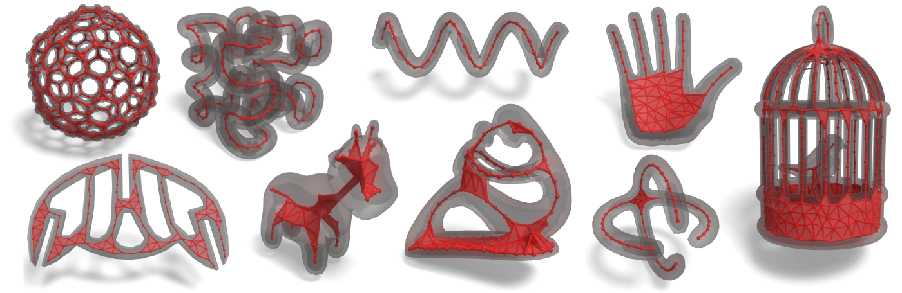

# Neural skeleton: implicit neural representation away from the surface

This repository contains the research code of the medial skeleton extration technique described in "Neural skeleton: implicit neural representation away from the surface", Mattéo Clémot, Julie Digne.

## Dependencies
The following Python packages are required:
* bpy (only for renderings)
* gudhi
* matplotlib
* NumPy
* PyGEL3D 
* PyTorch (>= 1.13)
* SciPy (>= 1.9)
* tabulate

## Usage

### Pretraining
The repository comes with pretrained networks, but networks can pretrained again by calling `python pretrain.py`.

### Reproducing comparison and ablation experiments
* `python reproduce_benchmark.py 0` reproduces the comparison between skeletonization methods on the benchmark shape (with several level of noise / missing parts) **(Table 1)**
* `python reproduce_cube.py 0` reproduces the comparison between some skeletonization methods on a cube shape, and produces slices of the obtained SDFs **(Figure 3)**
* `python reproduce_fertility.py 0` reproduces the comparison between some skeletonization methods on the fertility mesh, and produces slices of the obtained SDFs **(Figure 13)**
* `python reproduce_torus.py 0` reproduces the ablation study on a torus (with several levels of noise / missing parts) **(Table 2)**
* `python reproduce_ablation.py 0` reproduces the ablation study on the benchmark shape (with several levels of noise / missing parts)

### Reproducing renderings
* `python main.py [shape1] [shape2] [shape3] ...` computes the neural skeleton of the given shape among the following list: bimba, birdcage, bitore, buckminsterfullerene, bunny, dino, dragon, fertility, guitar, hand, hand2, helice, hilbert, lamp, metatron, pillowbox, protein, spot, zilla.
* `python render.py [shape]` renders a skeleton obtained with the above command, along the original shape, using Blender. It also outputs a Blender file that can be used to modify the rendering parameters.

