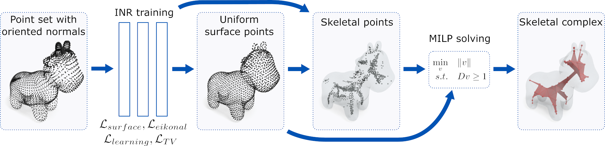
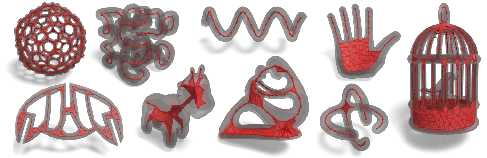

# Neural skeleton: implicit neural representation away from the surface

This repository contains the code for the medial skeleton extration technique described in [*Neural skeleton: implicit neural representation away from the surface*](https://hal.science/hal-04159959), Mattéo Clémot, Julie Digne, Computer & Graphics, Proceedings Shape Modeling International, 2023. Our paper was granted the [Graphics Replicability Stamp](https://www.replicabilitystamp.org/#https-github-com-mclemot-skeletonlearning) and the SMI 2023 **Best Paper Award**. 

The code is tested under Linux 22.04 and Windows 11.




## Dependencies
We use Python 3.10 for compatibility with the bpy library. The following packages are required:
* bpy (only for renderings)
* gudhi
* matplotlib
* NumPy
* PyGEL3D 
* PyTorch (>= 1.13)
* SciPy (>= 1.9)
* tabulate

To install on Linux, run the following commands:
```
git clone --recursive https://github.com/MClemot/SkeletonLearning/
cd SkeletonLearning
sudo apt install python3.10-venv
python3.10 -m venv skelenv
source skelenv/bin/activate
pip3 install bpy gudhi matplotlib numpy PyGEL3D scipy tabulate
pip3 install torch torchvision torchaudio --index-url https://download.pytorch.org/whl/cu118
```

## Usage

### Pretraining
The repository comes with pretrained networks, but networks can pretrained again by calling `python pretrain.py`.

### Compute a skeleton
`python main.py [input] [output]` computes a neural skeleton of the given input file, that can be either a `.obj` mesh file that will be sampled, or a `.xyz` file directly containing a point cloud with normals. It outputs a `.obj` skeletal mesh file.

### Replicability Stamp

TLDR: to compute and render the skeleton of the *spot* shape, run `python reproduce_renderings.py spot`.

This produces several files:
- Results/cvsk_Sine_spot.obj : the skeleton simplicial complex
- Results/unif_points_Sine_spot.obj : point set uniformly sampled on the surface (output of the uniform sampling step)
- Results/skeletal_points_Sine_spot.obj : extracted skeletal points (output of the skeleton tracing)
- Networks/net_64_6_Sine_spot.net : trained INR
- Renderings/spot.blend : saved blender file
- Renderings/spot.png : rendering of the shape and its skeleton

#### Reproducing renderings
* `python reproduce_renderings.py [shape1] [shape2] [shape3] ...` computes the neural skeleton of the given shapes with our method, then renders the skeleton along the original shape using Blender. It also outputs intermediate steps and a Blender scene file that can be used to modify the rendering parameters. The shapes can be chosen among the following list: *birdcage*, *bitore*, *buckminsterfullerene*, *fertility*, *hand*, *helice*, *hilbert*, *lamp*, *metatron*, *protein*, *spot*, *zilla*. This can be used to reproduce **Figure 1** and our column in **Figures 4, 5, 6**.

#### Reproducing comparison and ablation experiments

Notice that some of these experiments can take up to several hours.
* `python reproduce_benchmark.py 0` reproduces the comparison between skeletonization methods on the benchmark shape (with several level of noise / missing parts) **(Table 1)**
* `python reproduce_cube.py 0` reproduces the comparison between some skeletonization methods on a cube shape, and produces slices of the obtained SDFs **(Figure 3)**
* `python reproduce_fertility.py 0` applies some skeletonization methods on the fertility mesh **(skeletons depicted in Figure 12)**, and produces slices of the obtained SDFs **(Figure 13)**
* `python reproduce_torus.py 0` reproduces the ablation study on a torus (with several levels of noise / missing parts) **(Table 2)**



## Citation
If you use our code, please cite the following paper:
```
@article{neuralskeleton,
    title={Neural skeleton: implicit neural representation away from the surface},
    author={Clémot, Mattéo and Digne, Julie},
    journal={Computer & Graphics 2023, Proceedings SMI 2023},
    year={2023}
  }
```

## Acknowledgments

This work was supported by French Agence Nationale de la Recherche - TOPACS Project - ANR-19-CE45-0015

## Model Licenses

| Shape        | License   | Origin |
|--------------|-----------|------------|
| birdcage				| CC BY-SA | [Thingi10K](https://ten-thousand-models.appspot.com/detail.html?file_id=131971)
| buckminsterfullerene	| CC BY	| [Thingi10K](https://ten-thousand-models.appspot.com/detail.html?file_id=41141)
| fertility				| AIM@SHAPE General License for Shapes | AIM@SHAPE	
| hilbert				| CC BY-SA | [Thingi10K](https://ten-thousand-models.appspot.com/detail.html?file_id=53754)
| lamp					| CC BY	| [Thingi10K](https://ten-thousand-models.appspot.com/detail.html?file_id=104559)
| metatron				| GNU - GPL	| [Thingi10K](https://ten-thousand-models.appspot.com/detail.html?file_id=54725)
| protein				| CC BY	| [Thingi10K](https://ten-thousand-models.appspot.com/detail.html?file_id=39878)
| spot					| CC0 1.0 |	[Keenan Crane](https://www.cs.cmu.edu/~kmcrane/Projects/ModelRepository/)
| vase                  |       | [Shihao Wu](https://shihaowu.net/)
| zilla					| CC BY	| [Thingi10K](https://ten-thousand-models.appspot.com/detail.html?file_id=214246)
