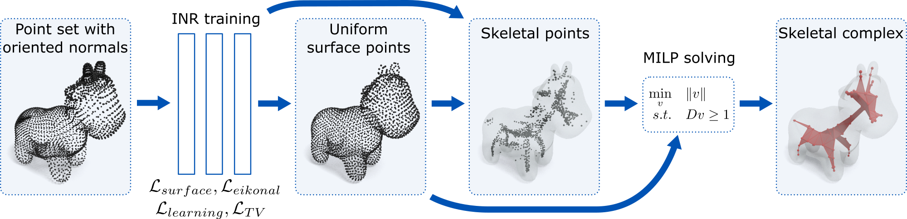

# Neural skeleton: implicit neural representation away from the surface

This repository contains the research code of the medial skeleton extration technique described in "Neural skeleton: implicit neural representation away from the surface", Mattéo Clémot, Julie Digne.

## Dependencies
The following Python packages are required: 
* Gudhi
* Matplotlib
* NumPy
* PyGEL3D 
* PyTorch
* SciPy
* Tabulate

Doing renderings requires in addition [Blender Toolbox](https://github.com/HTDerekLiu/BlenderToolbox) and the following packages:
* bpy
* bmesh

## Usage

### Pretraining
The repository comes with pretrained networks, but networks can pretrained again by calling `python pretrain.py`.

### Reproducing comparison and ablation experiments
* `python reproduce_benchmark.py 0` reproduces the comparison between skeletonization methods on the benchmark shape (with several level of noise / missing parts) **(Table 1)**
* `python reproduce_cube.py 0` reproduces the comparison between some skeletonization methods on a cube shape, and produces slices of the obtained SDFs **(Figure 3)**
* `python reproduce_fertility.py 0` reproduces the comparison between some skeletonization methods on the fertility mesh, and produces slices of the obtained SDFs **(Figure 13)**
* `python reproduce_torus.py 0` reproduces the ablation study on a torus (with several levels of noise / missing parts) **(Table 2)**
* `python reproduce_ablation.py 0` reproduces the ablation study on the benchmark shape (with several levels of noise / missing parts)

### Reproducing renderings